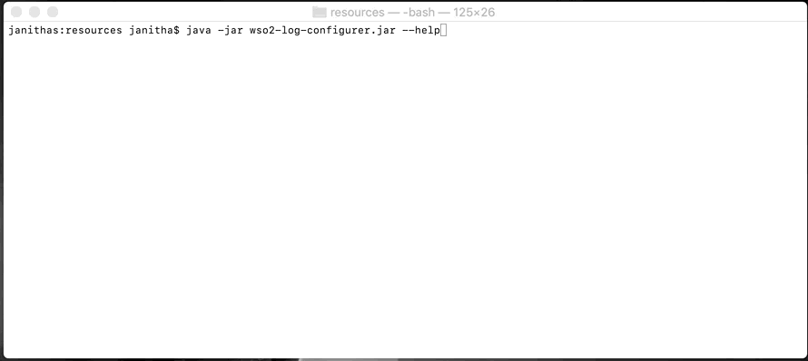
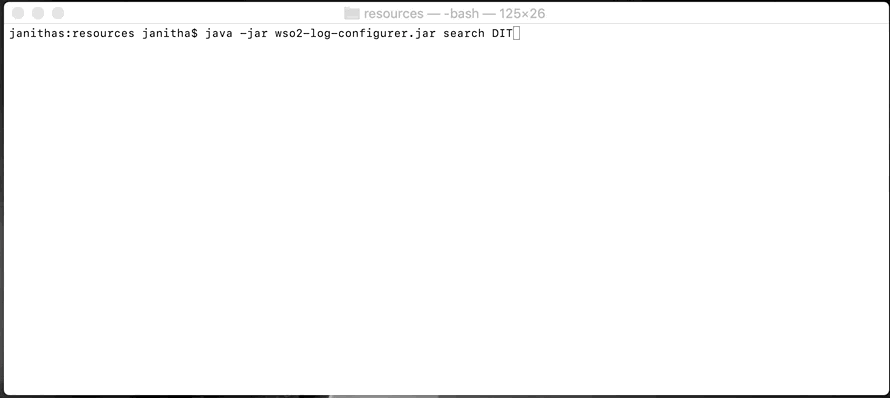
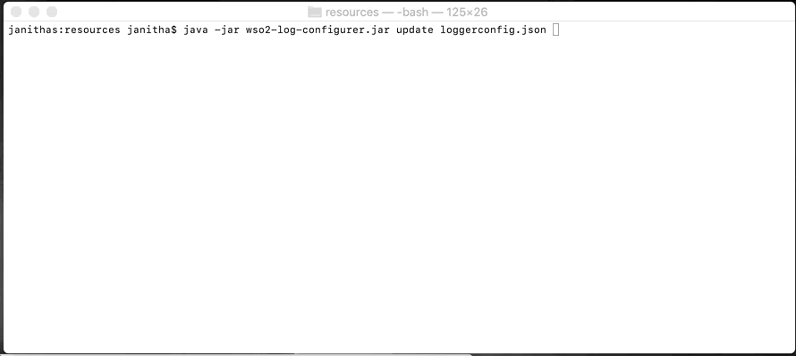

# wso2-log-configurer
This java application is to overcome the problem of not having a GUI to change log levels and set the additivity values in WSO2 product nodes.

### Pre-requirements
* Running WSO2 product where you can access admin log service.
* Maven
* Java (1.8+)

### Configurations
Default server configurations are stored in ``<HOME>/src/main/resources/serverconfig.json``
You can change the configurations accordingly.

### Build

Use the terminal and go to the home file location

Execute the command ``mvn clean package``

Find the `wso2-log-configurer.zip` zip file inside the `target` directory which
you can copy to a preferred location in your file system. Then Extract the content. You will find a `resource` folder and `wso2-log-configurer.jar` file inside the zip file.

### Run

You can execute the following command to see how to use the tool.

`java -jar wso2-log-configurer.jar --help`

###

### Available commands

All commands start with `java -jar wso2-log-configurer.jar`

*NOTE*: Default server configuration is using the default HTTPS port (9443) of a locally
        running WSO2 server. Copy the default key store file to the location you are
        running the jar file and you should be able to successfully execute following
        commands.

```
search <search phrase>
search <search phrase> --starts-with

update <update-log>.json
```

#### Passing custom server configuration

Create a json in the following format and save it as `serverconfig.json`

For single server deployment
```json
{
  "hostname":"https://localhost:9443",
  "username":"admin",
  "password":"admin",
  "systemProperties" : [
    {
      "key":"javax.net.ssl.trustStore",
      "value":"<PATH>/wso2carbon.jks"
    },
    {
      "key":"javax.net.ssl.trustStorePassword",
      "value": "wso2carbon"
    },
    {
      "key":"javax.net.ssl.trustStoreType",
      "value":"JKS"
    }
  ]
}
```
or clustered environment

```json
{
  "hostname":"https://localhost:9443,https://localhost:9444,https://localhost:9445",
  "username":"admin",
  "password":"admin",
  "systemProperties" : [
    {
      "key":"javax.net.ssl.trustStore",
      "value":"<PATH>/wso2carbon.jks"
    },
    {
      "key":"javax.net.ssl.trustStorePassword",
      "value": "wso2carbon"
    },
    {
      "key":"javax.net.ssl.trustStoreType",
      "value":"JKS"
    }
  ]
}
```
Now you can use `--config` command to pass the custom configuration.

Example:

``java -jar wso2-log-configurer.jar --config serverconfig.json search AUDIT``

#### Update logs JSON file

To update logs, a json file with a single entry, or multiple entries can be used.

Format of a single update json file
```json
{
    "loggerName":"AUDIT_LOG",
    "loggerLevel":"DEBUG",
    "additivity":true
}
```

Format of a bulk update json file
```json
[
    {
    "loggerName":"AUDIT_LOG",
    "loggerLevel":"DEBUG",
    "additivity":true
    },
    {
    "loggerName":"API_LOGGER.HealthCheck",
    "loggerLevel":"DEBUG"
    },
    {
    "loggerName":"API_LOGGER.ECommOrderTriggerAPI",
    "additivity":false
    }
]
```

_Note that the above commands need to be passed in the given order_

Sensitive properties (passwords) can be passed after the above commands

```
--upassword <user password> --kpassword <keystore password>
```

Example:

`java -jar wso2-log-configurer.jar search AUDIT --upassword admin`

_Single or both passwords can be passed in any order after the arguments are passed_

#### Passing server configurations by environment variables

You can define environment variables as follows. They will be prioritized over
the default configuration

| Environment variable              | JSON configuration name           |
| --------------------------------- | --------------------------------- |
| server.hostname                   | hostname                          |
| server.username                   | username                          |
| server.password                   | password                          |
| javax.net.ssl.trustStore          | javax.net.ssl.trustStore          |
| javax.net.ssl.trustStorePassword  | javax.net.ssl.trustStorePassword  |
| javax.net.ssl.trustStoreType      | javax.net.ssl.trustStoreType      |

### Resources

The default configurations and resources can be found in `<HOME>/resources`

### Samples

Help


Search


Update


Search in cluster


Update a cluster


